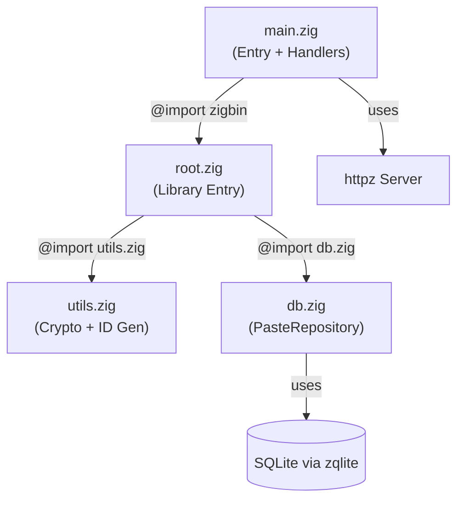

# Zigbin Text-Storage API

## Credits & Acknowledgements
This project is built with and inspired by the following open-source projects:
- **[Zig](https://codeberg.org/ziglang/zig)** - The Zig programming language (MIT License)
- **[httpz](https://github.com/karlseguin/http.zig)** - A fast HTTP server for Zig by Karl Seguin (MIT License)
- **[zqlite](https://github.com/karlseguin/zqlite.zig)** - A lightweight SQLite wrapper for Zig by Karl Seguin (MIT License)

---

## Architecture



## Features

### 🔒 Password Protection

- Send `X-Password` header on `POST /p` to protect a paste
- Password is hashed with **SHA-256** before storage (never stored in plain text)
- On `GET /p/:id`, send password via `X-Password` header or `?pw=` query param
- Returns **401** if no password provided, **403** if wrong password

### ⏰ Expiration Time

- Send `X-Expires-In` header (milliseconds) on `POST /p`
- Server calculates absolute `expires_at = now + duration`
- On `GET /p/:id`, returns **410 Gone** if paste has expired
- `PasteRepository.deleteExpired()` available for periodic cleanup

### 📅 Availability Window

- Send `X-Available-At` header (unix epoch ms) on `POST /p`
- On `GET /p/:id`, returns **425 Too Early** if paste is not yet available
- Response includes `available_at` timestamp so client knows when to retry

### 📎 File Upload Support

- Send `X-Filename` header on `POST /p` with the original filename
- File content goes in the request body as raw text
- On `GET /p/:id`, the `X-Filename` header is echoed back

---

## API Usage Examples

```bash
# Simple paste
curl -d "hello world" http://localhost:5882/p

# Password-protected paste
curl -d "secret stuff" -H "X-Password: mypass123" http://localhost:5882/p

# Retrieve with password
curl -H "X-Password: mypass123" http://localhost:5882/p/abc12345
# or
curl http://localhost:5882/p/abc12345?pw=mypass123

# Paste with 1-hour expiration
curl -d "temporary" -H "X-Expires-In: 3600000" http://localhost:5882/p

# Upload a file
curl --data-binary @readme.txt -H "X-Filename: readme.txt" http://localhost:5882/p

# Scheduled paste (available from a future timestamp)
curl -d "surprise!" -H "X-Available-At: 1748400000000" http://localhost:5882/p
```

---
